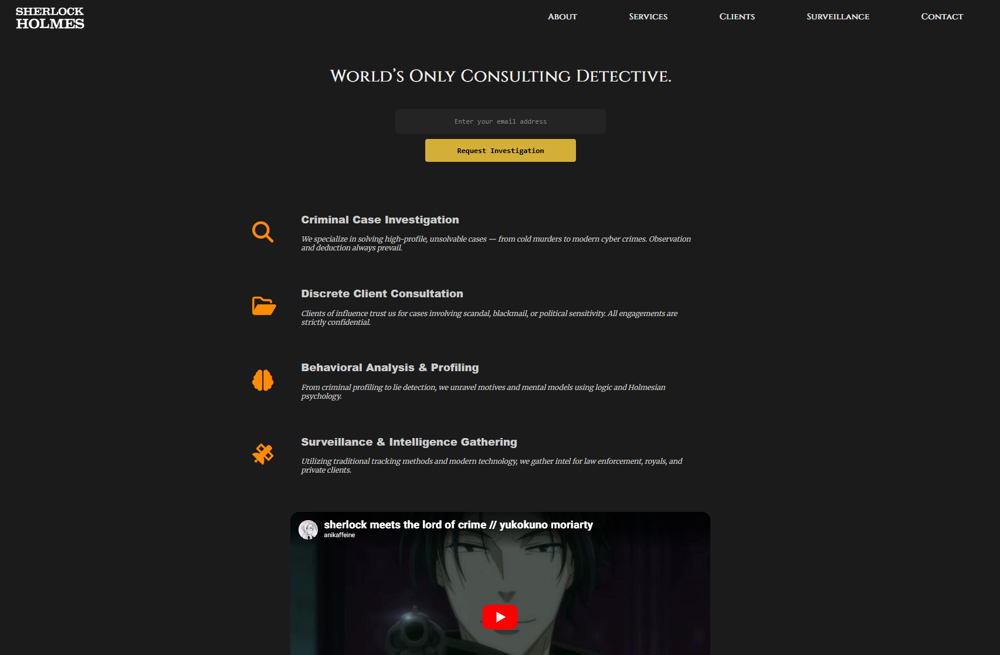

# Sherlock Holmes Consultancy Service - Product Landing Page

A modern, responsive, and uniquely designed product landing page for the **Sherlock Holmes Consultancy Service**. Built with **HTML** (`index.html`), **CSS** (`styles.css`), and featuring a custom **logo** (`logo.png`), this page combines sleek UI with subtle Sherlock Holmes-inspired Easter eggs to engage visitors.

## Features

- **Responsive Design:** Seamlessly adapts to all screen sizes — mobile, desktop.
- **Modern & Minimal UI:** Clean layout with elegant typography and intuitive navigation.
- **Unique Sherlock Holmes Theme:** Incorporates subtle references and Easter eggs inspired by the legendary detective, adding character and intrigue.
- **Custom Logo:** Includes a distinctive `logo.png` that fits the brand identity.
- **User-Friendly:** Clear call-to-actions and easy-to-navigate sections designed for conversion.

## Preview

  

## Demo

View the live site here:  
[https://saikat-codes.github.io/product-landing-page/](https://saikat-codes.github.io/product-landing-page/)

## Getting Started

1. **Clone the repository:**
  git clone https://github.com/saikat-codes/product-landing-page.git
2. **Open `index.html` in your browser** to explore the landing page.
3. **Customize** the content, styles, or Easter eggs as desired.

## Technologies Used

- **HTML5** (`index.html`)
- **CSS3** (`styles.css`)
- **Image Asset:** `logo.png`

## Folder Structure

/project-root
├── index.html
├── styles.css
├── logo.png
└── README.md

## Customization

- Update text, images, and Easter eggs in `index.html`.
- Modify styles and layout in `styles.css` to suit your branding.
- Replace or update the `logo.png` to personalize your brand identity.

## Inspiration & References

Inspired by the iconic Sherlock Holmes character and stories, blending Victorian-era motifs with modern web design principles to create a landing page that’s both engaging and memorable.

## Credits

Created by [Saikat Das](https://github.com/saikat-codes).

---

Feel free to use, modify, or expand this project for your own creative or professional needs!

